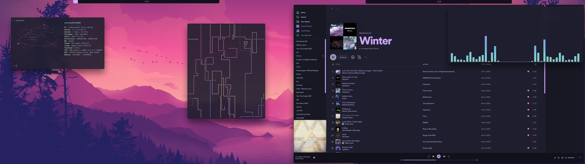
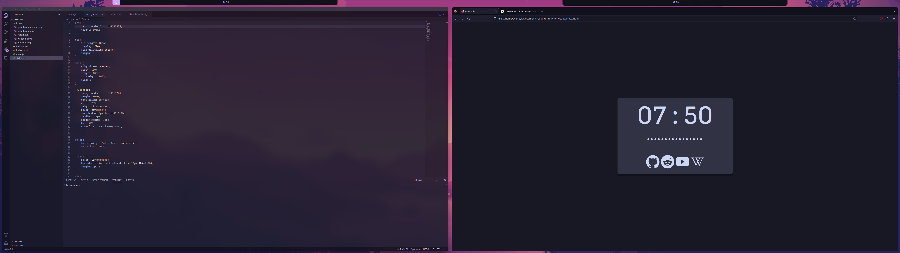

# Dots

## Branches
- Main pc (main)
- Laptop (laptop)
---
## Screenshots
 

## Specs
- Distro - [Endeavour OS](https://endeavouros.com/)
- WM - [bspwm](https://github.com/baskerville/bspwm)
- Compositor - [picom](https://github.com/yshui/picom)
- Bar - [Polybar](https://github.com/polybar/polybar)
- Menu - [Rofi](https://github.com/davatorium/rofi)
- Terminal - [Kitty](https://github.com/kovidgoyal/kitty)
 
 
- Colour palette - [Catppucinn Mocha (Mauve)](https://github.com/catppuccin/catppuccin)
- Dual 2560x1440 monitor setup

## Apps
- [neofetch (fetch script)](https://github.com/dylanaraps/neofetch)
- [pipes.sh](https://github.com/pipeseroni/pipes.sh)
- [Spotify](https://wiki.archlinux.org/title/spotify) w/ [spicetify](https://spicetify.app/)
- [cava (Music visualizer)](https://github.com/karlstav/cava)
- [Code-OSS](https://github.com/microsoft/vscode) w/ [catpuccin mocha theme](https://github.com/catppuccin/vscode)
- [Firefox](https://www.mozilla.org/en-US/firefox/new/) w/ [catpuccin mocha theme](https://github.com/catppuccin/firefox)