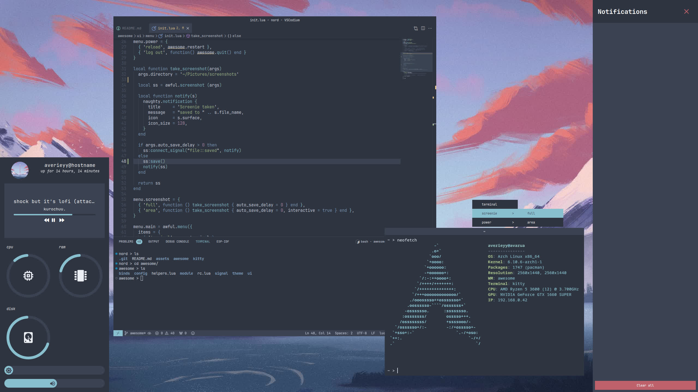

<h1 align="center">~ awesomewm configs ~</h1>

<figure>

Before you continue, please notice these configs are created by someone who barely knows lua, but who is trying their best. Brain damage may occur after long exposure to this code. <b>Read at your own risk</b>

</figure>

## credit where credit's due

- [**Modular awesomewm configs**](https://github.com/Gwynsav/modular-awm-default) - *Gwynsav*